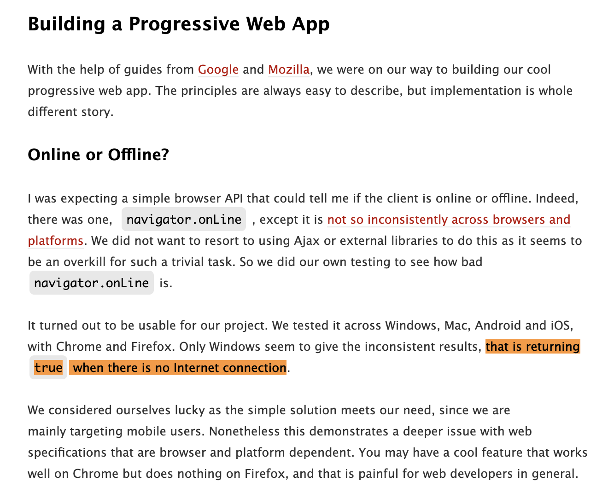
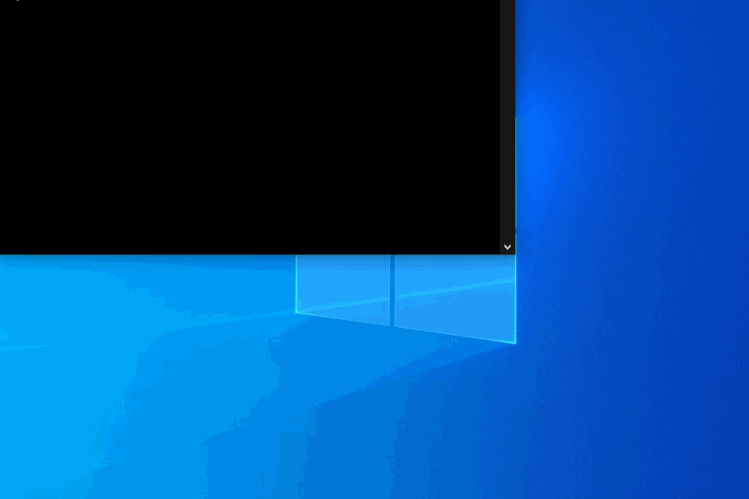

# network-interface

---

[![electron modules][electron-modules-image]][electron-modules-url]
[![NPM version][npm-image]][npm-url]
[![build status][build-image]][build-url]
[![node version][node-image]][node-url]
[![npm download][download-image]][download-url]

[electron-modules-image]: https://img.shields.io/badge/electron-modules-blue.svg
[electron-modules-url]: https://github.com/electron-modules/electron-modules
[npm-image]: https://img.shields.io/npm/v/network-interface.svg
[npm-url]: https://npmjs.org/package/network-interface
[build-image]: https://img.shields.io/appveyor/build/electron-modules/network-interface.svg?logo=appveyor
[build-url]: https://ci.appveyor.com/project/electron-modules/network-interface
[node-image]: https://img.shields.io/badge/node.js-%3E=_8-green.svg
[node-url]: http://nodejs.org/download/
[download-image]: https://img.shields.io/npm/dm/network-interface.svg
[download-url]: https://npmjs.org/package/network-interface

> Operating system network-related library for Node.js is used to obtain hardware status and network environment changes, etc.

## Introduction

The goal of this project is to provide a library that can be used by Node.js so that we can accurately obtain the current computer network status and support the integrated use of frameworks like Electron. At this stage, only some APIs of [wlanapi](https://docs.microsoft.com/en-us/windows/win32/api/wlanapi/nf-wlanapi-wlanregisternotification) and [netlistmgr](https://docs.microsoft.com/en-us/windows/win32/api/netlistmgr/nn-netlistmgr-inetworkconnectionevents) are wrapped.

### More cases

<p align="center">
  
</p>

0. https://paradite.com/2016/09/28/my-experience-building-progressive-web-app-pwa
1. https://github.com/electron/electron/issues/11290

## Installment

```bash
$ npm i network-interface --save
```

## Usage

<p align="center">
  
</p>

```javascript
const networkInterface = require('network-interface');

networkInterface.addEventListener('wlan-status-changed', (error, data) => {
  if (error) {
    throw error;
    return;
  }
  console.log('event fired: wlan-status-changed');
  console.log(data);
});
```

## Future plan

Only supports windows platform? Because I don’t need to solve the problems of other platforms, others may be supported in the future, and hope you can give some contributions.

<!-- GITCONTRIBUTOR_START -->

## Contributors

|[<br/><sub><b>xudafeng</b></sub>](https://github.com/xudafeng)<br/>|
| :---: |


This project follows the git-contributor [spec](https://github.com/xudafeng/git-contributor), auto updated at `Wed Dec 08 2021 11:38:44 GMT+0800`.

<!-- GITCONTRIBUTOR_END -->

## License

The MIT License (MIT)
